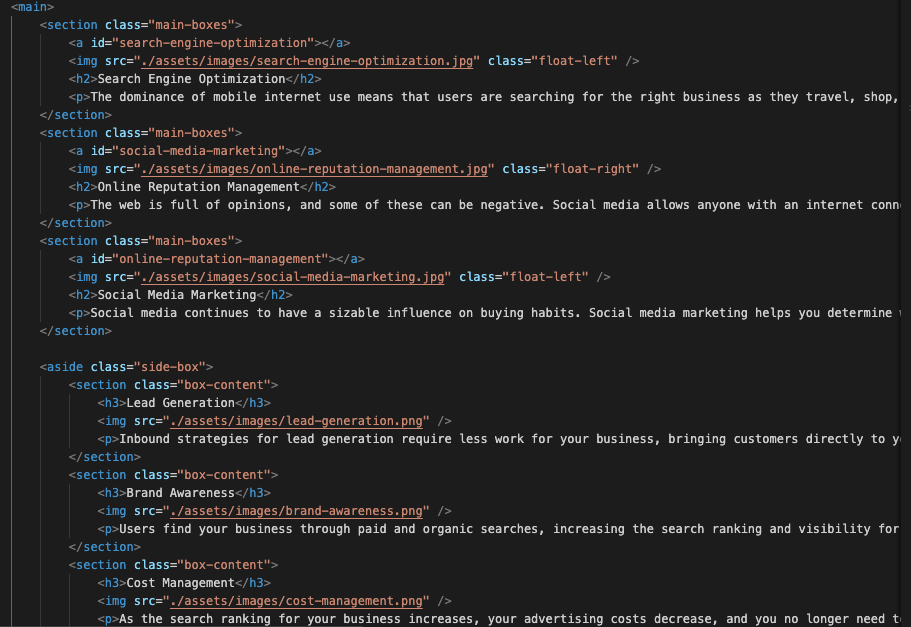
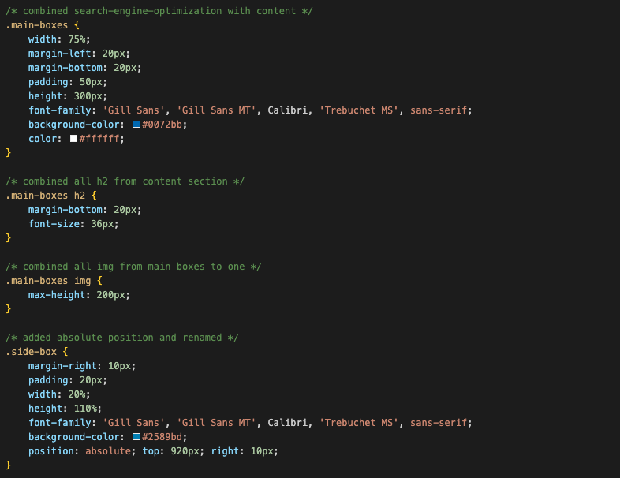

# Horiseon-Refactor

## Description

![Link to deployed site] (https://jonnyboy808.github.io/horiseon-raddefactor/)

This webpage refactor was created for the Horiseon marketing agency. The webpage refactor was conducted to make sure uneccesary code wasn't present so that it may load quicker with out a heavy strain on consumer web browsers. While conducting the refactor, accessibility was kept in mind to make interacting with web elements simple.

## Installation

N/A

## Usage

You can use this site to fiund out information on specific topics. You may also use the header withing this site to quickly navigate to the specific sections of the website quickly.

Examples of refactored code:

## Credits

N/A

## License

No license at this time